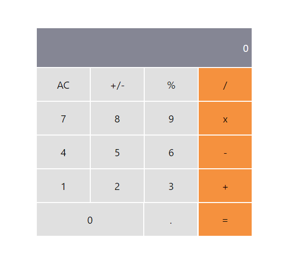

# Math Magicians
create the Math Magicians app which inculde a functionality for calculator


## Features:
- Add UI for calculator by using react components
- Add Events to calcultor

## Built using

- React
- CSS
- Linters

## Getting Started

after cloneing

```
cd MY-APP
npm install
npm start
```


## Authors

👤 **Omar Salem**

- GitHub: [Omar Salem](https://github.com/omarsalem7)
- Twitter: [Omar Salem](https://twitter.com/Omar80491499)
- LinkedIn: [Omar Salem](https://www.linkedin.com/in/omar-salem-a6945b177/)


## Show your support

Give a ⭐️ if you like this project!
